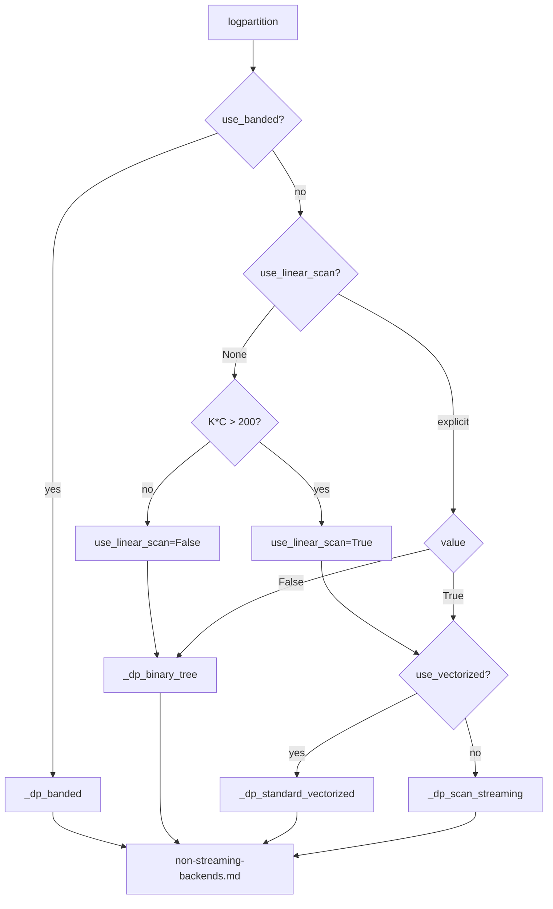

# Sentinel: Non-Streaming Backends

**Verified against:** `src/torch_semimarkov/semimarkov.py` @ commit `40fe66b`
**Linked tests:** `tests/test_semimarkov.py`

## Summary

The `SemiMarkov` class provides multiple algorithm variants for computing partition functions over pre-computed edge tensors. Unlike the streaming API (which computes edges on-the-fly from cumulative scores), these backends operate on fully materialized edge tensors of shape `(batch, N-1, K, C, C)`.

## API Entry Point

```python
SemiMarkov(semiring).logpartition(
    log_potentials,      # (batch, N-1, K, C, C) - pre-computed edge tensor
    lengths=None,        # (batch,) - sequence lengths
    force_grad=False,
    use_linear_scan=None,   # Auto-selects based on K*C threshold
    use_vectorized=False,
    use_banded=False,
    banded_perm="auto",
    banded_bw_ratio=0.6,
)
```

**Location:** `semimarkov.py:35-83`

## Algorithm Selection Decision Tree



## Algorithm Lookup Table

| Condition | Algorithm | Method | Complexity | Memory |
|-----------|-----------|--------|------------|--------|
| `use_banded=True` | Banded binary tree | `_dp_banded` | O(N log N × bw × KC) | O(N × (KC)²) |
| `K*C <= 200` (auto) | Binary tree | `_dp_binary_tree` | O(N log N × (KC)³) | O(N × (KC)²) |
| `K*C > 200`, vectorized | Vectorized scan | `_dp_standard_vectorized` | O(N × K × C²) | O(N × K × C) |
| `K*C > 200`, default | Ring buffer scan | `_dp_scan_streaming` | O(N × K × C²) | O(K × C) |
| (legacy) | Standard scan | `_dp_standard` | O(N × K × C²) | O(N × K × C) |

**Auto-selection threshold:** `semimarkov.py:62-65`
```python
K_C_product = K * C
use_linear_scan = K_C_product > 200
```

## Duration Indexing Convention

**Non-streaming backends use 1-based duration indexing** (differs from streaming):

| Duration value | Array index | Access pattern              |
|----------------|-------------|-----------------------------|
| k = 1          | 1           | `edge[:, :, n, 1, :, :]`    |
| k = 2          | 2           | `edge[:, :, n, 2, :, :]`    |
| ...            | ...         | ...                         |
| k = K-1        | K-1         | `edge[:, :, n, K-1, :, :]`  |

**Formula:** `dur_idx = k` (direct indexing, index 0 unused)

Note: This differs from streaming backends which use 0-based indexing (`dur_idx = k - 1`). The streaming convention is the production target and will be adopted post-benchmarking.

### Evidence in Code

**Binary tree** (`semimarkov.py:122-124`):
```python
c[:, :, : K - 1, 0] = semiring.sum(
    torch.stack([c.data[:, :, : K - 1, 0], lp[:, :, 1:K]], dim=-1)
)
```

**Ring buffer scan** (`semimarkov.py:202-206`):
```python
# Duration k uses edge index k-1
dur_idx = dur - 1
edge_slice = edge[:, :, start, dur_idx, :, :]  # (ssize, batch, k_eff, C, C)
```

**Standard/Vectorized** (`semimarkov.py:262-266`, `308-312`):
```python
# Duration k (1 to K) uses index k-1 (0-based indexing)
t = max(n - K - 1, -1)
f1 = torch.arange(n - 1, t, -1)  # time positions [n-1, n-2, ..., n-K]
f2 = torch.arange(0, len(f1))    # duration indices [0, 1, ..., K-1]
```

## Edge Tensor Semantics

**Shape:** `(batch, N-1, K, C, C)`

**Indexing:** `edge[b, n, k, c_dst, c_src]`
- `b`: batch index
- `n`: position index (0 to N-2)
- `k`: duration index (0 to K-1, representing durations 1 to K)
- `c_dst`: destination label (segment ends with this label)
- `c_src`: source label (previous segment ended with this label)

**Transition semantics:** Destination-first in last two dimensions
```python
edge[..., c_dst, c_src] = score for c_src → c_dst transition
```

This matches the streaming API's `edge_block[c_dst, c_src]` convention.

## Algorithm Details

### 1. Binary Tree (`_dp_binary_tree`)

**Location:** `semimarkov.py:85-148`

Computes partition via parallel prefix (binary tree reduction) over (K×C, K×C) state matrices.

**Key steps:**
1. Initialize chart with identity elements on diagonal
2. Incorporate edge potentials at leaf level
3. Binary tree reduction via matrix multiplication
4. Extract final partition from root

**Duration loop** (`semimarkov.py:129-133`):
```python
for k in range(1, K):
    mask_length_k = mask_length < (lengths - 1 - (k - 1)).view(batch, 1, 1)
    mask[:, :, :, k - 1, k].diagonal(0, -2, -1).masked_fill_(mask_length_k, True)
```

### 2. Ring Buffer Scan (`_dp_scan_streaming`)

**Location:** `semimarkov.py:150-228`

O(N) linear scan with O(KC) memory using ring buffer for beta history.

**Ring buffer mechanics** (`semimarkov.py:165-171`):
```python
ring_len = K
beta_hist = torch.zeros((ssize, batch, ring_len, C), ...)
beta_hist[:, :, 0, :] = beta0
head = 0  # beta[n-1] lives at beta_hist[:, :, head, :]
```

**Modular indexing** (`semimarkov.py:197-200`):
```python
# beta[n-dur] is at index (head - (dur - 1)) % ring_len
ring_idx = (head - (dur - 1)) % ring_len
beta_prev = beta_hist.index_select(2, ring_idx)
```

**Head advancement** (`semimarkov.py:222-224`):
```python
head = (head + 1) % ring_len
beta_hist[:, :, head, :] = beta_n
```

### 3. Standard Scan (`_dp_standard`)

**Location:** `semimarkov.py:230-275`

Reference implementation using list comprehensions. Kept for backward compatibility.

**Beta accumulation** (`semimarkov.py:266-271`):
```python
t = max(n - K - 1, -1)
f1 = torch.arange(n - 1, t, -1)  # [n-1, n-2, ..., n-K]
f2 = torch.arange(0, len(f1))     # [0, 1, ..., K-1]
beta[n][:] = semiring.sum(
    torch.stack([alpha[:, :, a, b] for a, b in zip(f1, f2, strict=True)], dim=-1)
)
```

### 4. Vectorized Scan (`_dp_standard_vectorized`)

**Location:** `semimarkov.py:277-324`

2-3x faster than `_dp_standard` via advanced indexing instead of list comprehension.

**Vectorized gather** (`semimarkov.py:313-318`):
```python
time_indices = torch.arange(n - 1, t, -1, device=edge.device)
dur_indices = torch.arange(0, time_indices.numel(), device=edge.device)
gathered = alpha[:, :, time_indices, dur_indices, :]  # (ssize, batch, k_eff, C)
beta[n][:] = semiring.sum(gathered, dim=-2)
```

### 5. Block-Triangular (`_dp_blocktriangular`)

**Location:** `semimarkov.py:326-417`

Binary tree with sparse block-triangular matrix representation exploiting duration constraint `k1 + k2 <= span`.

### 6. Banded (`_dp_banded`)

**Location:** `semimarkov.py:503-621`

Binary tree with banded matrix representation. Uses permutation optimization (snake, RCM) to minimize bandwidth.

**Bandwidth decision** (`semimarkov.py:577-584`):
```python
use_banded, perm, bw, threshold = self._choose_banded_permutation(
    span_length, K, C, banded_perm, banded_bw_ratio, device=edge.device
)
if not use_banded or (lu + ld + 1) >= matrix_size:
    chart = semiring.matmul(left, right)  # Fall back to dense
    continue
```

## HSMM Conversion

**Location:** `semimarkov.py:660-680`

Converts Hidden Semi-Markov Model parameters to edge potentials:

```python
@staticmethod
def hsmm(init_z_1, transition_z_to_z, transition_z_to_l, emission_n_l_z):
    """Convert HSMM params (init, trans, duration, emission) to edge potentials."""
    # edges shape: (batch, N, K, C, C)
    edges[:, 0, :, :, :] += init_z_1.view(batch, 1, 1, C)           # Initial state
    edges += transition_z_to_z.transpose(-1, -2).view(1, 1, 1, C, C) # State transitions
    edges += transition_z_to_l.transpose(-1, -2).view(1, 1, K, C, 1) # Duration given state
    edges += emission_n_l_z.view(batch, N, K, C, 1)                  # Emissions
    return edges
```

**Duration indexing in HSMM:** `transition_z_to_l` has shape `(K, C)` where index 0 = duration 1.

## Comparison with Streaming API

| Aspect                             | Non-Streaming                              | Streaming                           |
|------------------------------------|--------------------------------------------|-------------------------------------|
| **Input**                          | Pre-computed `edge (batch, N-1, K, C, C)`  | `cum_scores (batch, T+1, C)` + params |
| **Edge computation**               | User/upstream responsibility               | On-the-fly prefix-sum               |
| **Memory (T=1000, K=100, C=24)**   | ~19.2 GB                                   | ~92 KB                              |
| **Duration indexing**              | `dur_idx = k` (1-based)                    | `dur_idx = k - 1` (0-based)         |
| **Transition semantics**           | `edge[..., c_dst, c_src]`                  | `edge_block[c_dst, c_src]`          |
| **Gradient support**               | Via autograd on edge tensor                | Custom backward kernels             |
| **Use case**                       | Small sequences, pre-computed edges        | Training, long sequences            |

## Critical Invariants

- [ ] Duration index `k` for duration value `k` (1-based storage, indices 1 to K-1)
- [ ] Edge tensor last two dims are `(c_dst, c_src)` - destination first
- [ ] Ring buffer uses `(head - (dur - 1)) % ring_len` for history access
- [ ] Auto-selection threshold: `K*C > 200` triggers linear scan
- [ ] All algorithms produce identical partition values (up to numerical precision)
- [ ] Indexing differs from streaming API (0-based) - will be unified post-benchmarking

## Known Issues

| Issue | Severity | Algorithm | Notes |
|-------|----------|-----------|-------|
| O((KC)³) per matmul | Performance | Binary tree | Use linear scan for large state spaces |
| O(N×K×C) memory | Memory | Standard, Vectorized | Use ring buffer scan for memory efficiency |
| Banded permutation overhead | Performance | Banded | May not be worthwhile for small spans |

## Version History

- **2026-01-28**: Updated to document 1-based duration indexing (benchmarking divergence from streaming)
- **2026-01-28**: Initial trace @ commit `40fe66b`
